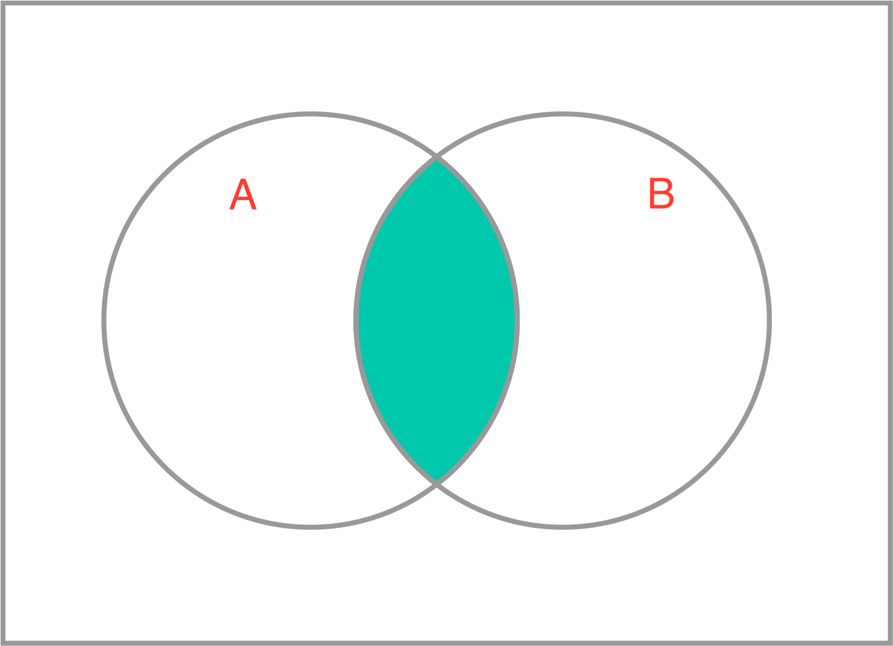

# Combinatorics and Probability

While we recommend using Python to find the answers to these questions, it is not required. You are more than welcome to use a calculator or pencil and paper to solve them, too.

???

# Quiz - Combinatorics and Probability

?: You want to determine all possible batting orders for seven players on a 12 person team. Does your computation involve
using permutations or combinations?

( ) Combinations
(X) Permutations

?: How would you compute the union of sets `a = {2, 4, 6}` and `b = {1, 3, 5}` using Python? 

Select all correct answers.

[X] `a|b`
[ ] `a&b`
[ ] `a^b`
[X] `a.union(b)`

?: What is the green shaded region in the Venn diagram image below equal to? 

(X) The intersection of A and B
( ) The union of A with the complement of B
( ) The union of A and B
( ) B

?: You have surveyed 100 individuals and asked them which type of food they enjoy best.

The following two-way table displays data for the sample of individuals who responded to your survey. 

|food type|children|adults|total|
|--|--|--|--|
|sweet|26|24|50|
|savory|18|32|50|
|total|44|56|100|

What is the probability of liking sweet food given the respondent was an adult, P(sweet|adult)? 

(X) 3/7
( ) 6/25
( ) 4/7
( ) 16/25

?: Imagine you have two bags: one has 7 red balls and 3 green ones, the other has 4 red balls and 6 green ones.
You toss a fair coin. If the coin lands heads, you pick a random ball from the first bag. If it lands tails, you
pick a random ball from the second bag. 

What is the probability that you pick a green ball?

( ) 3/10
( ) 3/20
(X) 9/20
( ) 11/20

???